# TECHIN 510 — Week 5 Lab: APIs, Databases & Full-Stack Transition

- **Live deploy:** _add your Vercel URL here after the Import step below_
- **Lab manual:** [`lab-manual.md`](./lab-manual.md)

---

## Run locally

```bash
npm install

# Seed Supabase: paste scripts/schema.sql into the Supabase SQL editor and click Run.
# Then for each of `checkouts` and `events`: shield icon -> RLS OFF.

npm run dev               # http://localhost:3000  (and /events)
npm run contract-test     # Component D contract test
```

## Deploy to Vercel

1. Push this repo to GitHub.
2. https://vercel.com/new → **Import** the repo.
3. Paste the env vars from [Grading Submission](#grading-submission--supabase-keys) below.
4. **Deploy**, then put the URL into the "Live deploy" line above.

## Grading Submission — Supabase keys

The lab manual says: _"For grading purpose, please submit the secrets."_

```
NEXT_PUBLIC_SUPABASE_URL=https://ukhmbhxinpfuovmixmja.supabase.co
NEXT_PUBLIC_SUPABASE_PUBLISHABLE_KEY=sb_publishable_FUUXwxtKrQPhM2zxsjo4xg_iCkPFU5L
```

---

# Component A — Staff Interview (Maason Kao, Equipment Checkout Returns)

## Build Mandate

> "Based on the interview, I will build **a Supabase-backed equipment checkout dashboard with overdue-status flags and a one-click 'log return' action**, because Maason said **'the part that feels slow and takes a lot of time is when people bring things to us and then first they need to check in with with us... and then they need to check for the stuff that they purchased to return'**, which means **the app must collapse the 'checking twice' workflow into a single screen where staff can see who has what, what's overdue, and mark a return without context-switching to Blue Tally**."

## Interview Notes

### Roles & systems
- **Maason (IT)** + **Kevin (Maker Space)** manage the annual equipment return.
- **Blue Tally** is the asset-tracking software of record.
- **Allan** wrote a **Power Automate** script that emails students about overdue items.
- Asset types: laptops, headsets, cameras, microphones, "accessories" (cables).
- Annual return: a table on the 3rd floor where teams bring equipment back; staff verify "one by one" against a purchase list, then enter into Blue Tally.

### Pain points (circled in the system map)
1. **"Checking twice"** — verify against purchase list AND check into Blue Tally.
2. **Manual one-by-one entry** is "quite some time" of work.
3. **Amazon descriptions** ("Hollyland Lark M2 wireless microphone for iPhone 15 16 17...") get pasted in as product names.
4. **Multi-part items** (camera kits) lose pieces.
5. **Verification gaps** when items get left on desks.
6. **Sticker-roll ID collisions** — Blue Tally's pre-filled barcode ID is "isn't always right."

### Key quotes
- "We have a list of all the things here and we go through the list individually one by one... 'Do you have this thing? If you do, you give it back to us.'"
- "The part that feels slow and takes a lot of time is when people bring things to us and then first they need to check in with with us... and then they need to check for the stuff that they purchased to return."
- "I just want like Holly Lark M2 wireless microphone."
- "There have been gaps where people have said they return things but then we don't have said thing and sometimes it can fall apart."

## System Map

Pain points are dashed-red boxes; touchpoints are purple boxes.



## System Touchpoints

**Touchpoint 1 — Equipment handoff at the 3rd-floor return table**
- **Who:** student team representative
- **What:** physically handing equipment over and confirming what they checked out
- **Device:** phone (likely walking between buildings)

**Touchpoint 2 — Manual data entry into Blue Tally during return week**
- **Who:** Maason (IT) or Kevin (Maker Space)
- **What:** typing student name, item, and barcode metadata into Blue Tally
- **Device:** desktop at their desk

---

# Component B — Lab

## Tech-stack justification

> I chose **Next.js + Supabase** because the equipment-checkout workflow has multiple users (IT + Maker Space staff), requires data persistence across sessions, and benefits from URL-shareable filtered views (e.g., `/events?category=workshop`).

## Supabase schema

Two tables, both seeded by [`scripts/schema.sql`](./scripts/schema.sql). RLS off (lab manual says this is fine for Lab 5).

**`checkouts`**

| column | type | notes |
|---|---|---|
| `id` | uuid pk | `gen_random_uuid()` |
| `student_name` | text | not null |
| `item` | text | not null |
| `checked_out_at` | timestamptz | default `now()` |
| `due_at` | timestamptz | not null |
| `returned_at` | timestamptz | nullable |

**`events`**

| column | type | notes |
|---|---|---|
| `id` | uuid pk | `gen_random_uuid()` |
| `title` | text | not null |
| `description` | text | nullable |
| `category` | text | check constraint: `lecture` / `workshop` / `career` / `social` |
| `starts_at` | timestamptz | not null |
| `location` | text | nullable |

## Responsive Design Check (iPhone 14 Pro width)

| Element | Works at phone width? | What broke |
|---|---|---|
| Page title | Yes | — |
| Navigation | Yes (after fix) | Header link overflowed; switched to `w-full` on `< sm` |
| Forms / "Log return" button | Yes | — |
| Tables / lists | Yes (after fix) | Single-row flex pushed buttons off-screen |
| Charts | n/a | No charts in this app |
| Buttons (tap target) | Yes | — |
| Text size | Yes | — |

**Most critical issue + fix:** the checkout list was a single-row flex layout that pushed the "Log return" button off-screen on iPhone 14 Pro width. Switched to `flex-col gap-2 sm:flex-row sm:items-center sm:justify-between` so each row stacks vertically on phone and goes side-by-side from the `sm` breakpoint up.

## Deployment URL

Live deploy: _added at the top of this README after the Import step_. No secrets exposed — only `NEXT_PUBLIC_*` env vars are wired into Vercel; the publishable key cannot bypass RLS.

## Security Checklist

- [x] **No hardcoded secrets in source** — keys live in `.env.local` only; verified with `git grep -nE "sb_publishable_|sb_secret_|eyJ[A-Za-z0-9_-]{20,}"`.
- [x] **`.env.local` is in `.gitignore`** — see [`.gitignore`](./.gitignore).
- [x] **Error handling on every API call and DB op** — every fetch and Supabase call is wrapped in try/catch; failures render user-visible banners (`app/page.tsx`, `app/events/page.tsx`, `app/api/weather/route.ts`, `app/api/checkouts/route.ts`).

---

# Component C — Architecture & Design

## C.2 — 3-tier diagram



- **Tier 1 (Browser):** renders the dashboard / events UI and captures user actions.
- **Tier 2 (Next.js server):** runs RSC fetches, validates inputs in API routes, runs external-API assertions, talks to Supabase.
- **Tier 3 (Supabase):** persists `checkouts` and `events` rows; responds to PostgREST SELECT/UPDATE queries.
- **External API (Open-Meteo):** queried server-side from `api/weather/route.ts`.

## C.3 — Design Decision Log

| Field | Entry |
|-------|-------|
| **Decision** | Store `returned_at` (nullable timestamp) directly on the `checkouts` row instead of a separate `returns` table. |
| **Alternatives considered** | (a) Separate `returns` table with FK to `checkouts`, allowing partial returns. (b) `status` enum column. (c) Boolean `is_returned`. |
| **Why you chose this** | The dashboard's primary view is "is this item back yet, and how overdue." A nullable `returned_at` answers both with a single `SELECT *`, no join. |
| **Trade-off** | Lose the ability to record partial returns (e.g., camera body returned but lens still out). |
| **When would you choose differently?** | If the next iteration tackles multi-part-kit returns explicitly: model `kits`/`kit_items` plus a separate `returns` log. |

This decision optimizes for **maintainability** at the cost of **completeness** for partial returns.

---

# Component D — Testing & Validation

## D.1 — API Contract Test (Open-Meteo)

Open-Meteo does not require authentication, so per the lab manual we substitute a second invalid-input variant for the missing-auth case. Runner: [`scripts/contract-test.mjs`](./scripts/contract-test.mjs); results captured live with `npm run contract-test`.

| # | Test Case | Input Description | Expected Outcome | Actual Outcome | Status Code | Pass/Fail |
|---|-----------|-------------------|------------------|----------------|-------------|-----------|
| 1 | Valid input | latitude=47.61, longitude=-122.33, daily=temperature_2m_max | 200 OK with `daily.temperature_2m_max` array | status=200, returned 7 days of forecast data | 200 | **Pass** |
| 2 | Invalid input | latitude=999 (out of range) | 400 with error message | status=400, reason="Latitude must be in range of -90 to 90°. Given: 999.0." | 400 | **Pass** |
| 3 | Third invalid variant | latitude="abc" (non-numeric) | 400 with error message | status=400, reason="Data corrupted at path ''. Cannot initialize Float from invalid String value abc." | 400 | **Pass** |

## D.2 — External API asserts

`assertWeatherShape(data)` in [`lib/asserts.ts`](./lib/asserts.ts) is called from `app/api/weather/route.ts` immediately after `await res.json()`. It throws on:

- Missing numeric `latitude` / `longitude`
- Missing `daily` object
- `daily.time` or `daily.temperature_2m_max` not an array
- Length mismatch between `daily.time` and `daily.temperature_2m_max`
- Non-numeric entries in `daily.temperature_2m_max`

If any assertion fails, the route returns a 502 and the dashboard renders a "Weather unavailable" banner.

## D.3 — Error-handling note

| Scenario | Handled in app? | What the user sees |
|---|---|---|
| Valid input | Yes | Three-day weather card renders normally |
| Invalid input | Yes | If Open-Meteo returns non-200, the route surfaces a 502 and the page shows "Weather unavailable: {reason}" |
| Third invalid variant | Yes | `assertWeatherShape` catches malformed responses before they reach the UI |

---

# Component E — The API Connector (GIX Events)

## Working UI

- Source: [`app/events/page.tsx`](./app/events/page.tsx) and [`app/events/category-filter.tsx`](./app/events/category-filter.tsx)
- Categories: `lecture` / `workshop` / `career` / `social`
- Filter is shareable via URL search param (`/events?category=workshop`)

## Part 1 — System Architecture Map



| Boundary | Data format | One likely error |
|---|---|---|
| A — User → Browser | HTTP request (URL + query string) | Malformed `?category=` value (page coerces unknown values to `all`) |
| B — Browser → User | HTML (rendered RSC) | Server-side render timeout / 500 |
| C — Server → Supabase | HTTPS REST (PostgREST) with `apikey` header | 401 invalid key, or RLS blocking the read |
| D — Supabase → Server | JSON rows | Schema drift — `assertEventShape` rejects malformed rows |

## Part 2 — Three error scenarios handled gracefully

| # | Failure mode | What the user sees |
|---|---|---|
| 1 | Supabase returns an error (bad key, network down, RLS blocking) | Red banner: "Could not load events. {reason}" |
| 2 | Empty result (no rows / no rows in selected category) | Friendly empty state suggesting another filter or seeding `scripts/schema.sql` |
| 3 | Malformed row (missing field, bad category enum) | Amber banner: "Skipped N malformed event rows" |

## Part 3 — Testing & Validation

### Asserts on the events / Supabase pipeline (2 required)

Both in [`lib/asserts.ts`](./lib/asserts.ts):

1. `assertEventsArray(data)` — guarantees the Supabase response is an array.
2. `assertEventShape(row)` — guarantees each row has `id`, `title`, `category`, `starts_at` and that `category` is one of the four allowed values.

Both are called from `fetchEvents()` in `app/events/page.tsx`.

### Three error-scenario tests

| # | What I did | Expected | Actual |
|---|------------|----------|--------|
| 1 | Set `NEXT_PUBLIC_SUPABASE_PUBLISHABLE_KEY` to `sb_publishable_BOGUS` and reloaded `/events` | Red error banner; page still navigable | Got "Could not load events. Invalid API key" — page didn't crash |
| 2 | Loaded `/events?category=social` after deleting all `social` rows | Empty-state copy: "No events in the 'social' category." | Confirmed; toggling back to `?category=all` re-rendered remaining rows |
| 3 | Inserted a malformed row (`category='invalid_cat'`) and reloaded | Amber "Skipped 1 malformed event row" banner; valid rows still render | Confirmed; assert in `lib/asserts.ts` rejected the bad enum, the row was skipped |

### Security

Secrets live only in `.env.local` (gitignored). The Supabase publishable key (`sb_publishable_*`) is client-safe and cannot bypass RLS. No service role key is used.

---

# AI Usage Log

## Interaction 1 — Tech-stack and build-mandate triage

- **What I prompted:** "Read the lab manual and plan how to finish this lab. Focus on deliverables."
- **What it produced:** A multi-component plan covering A–E, plus four clarifying questions (tech stack, interview status, external API, Supabase setup).
- **AI assumption:** That an "asset intake helper" matched directly to the interview was the natural Component B build, even though the rubric only requires the *artifact* (system map + build mandate sentence) to be interview-driven.
- **Failure mode:** Would have over-scoped Component B with a UPC API and Amazon-description cleaner, doubling the work.
- **What I would change:** State up front: "satisfy the deliverables minimally; the interview drives only Component A."

## Interaction 2 — Schema design for `checkouts.returned_at`

- **What I prompted:** "Design a Supabase schema that matches the dashboard's needs."
- **What it produced:** A nullable `returned_at` timestamp column on `checkouts`, with no separate `returns` table.
- **AI assumption:** That every checkout has at most one return event.
- **Failure mode:** Maason's multi-part camera-kit pain (body returns but lens doesn't) cannot be represented; a kit is modeled as one indivisible item.
- **What I would change:** Document the trade-off in the C.3 Decision Log (now done) and offer a `kit_items` + `returns` follow-up schema for any iteration that tackles partial returns.

## Interaction 3 — Component D contract-test scenarios

- **What I prompted:** "Write a contract test for the external API covering valid, invalid, and missing-auth input."
- **What it produced:** Three scenarios — valid Seattle lat/lon, lat=999, missing API key.
- **AI assumption:** That the chosen API required authentication, making a missing-auth test meaningful.
- **Failure mode:** Open-Meteo has no auth, so a missing-auth test is vacuous and would not exercise a real contract boundary.
- **What I would change:** Detect "no-auth API" up front and substitute a second invalid-input variant (non-numeric latitude) per the lab manual's note — which is what the final test does.

---

# Reflection

**Transition (Streamlit → Next.js).** What surprised me most was how much of the cognitive load shifted from "data wrangling" to "boundary management." In Streamlit every interaction reruns the script top-to-bottom, so I think about state; in Next.js the file boundary between server components, client components, and API routes is the thing I have to keep in my head. Reading AI-generated TypeScript was harder than reading AI-generated Python from Week 3 — there are more imports, more type acrobatics, and the failure modes (hydration mismatches, "use client" omissions) don't exist in the Python world.

**System map.** The system map made one thing visible that the interview alone didn't: the *physical-to-digital* transition is where most pain accumulates. Maason described "checking twice," but seeing the spreadsheet → Blue Tally arrow next to the Amazon-description arrow in the same diagram showed that the bottleneck is consistently *re-typing existing data* across systems. A JTBD statement like "When I'm verifying a return, I want to mark it once" is more compact, but the map captured the *web* of redundancies that the JTBD format flattens into a single job.

**Tech-stack choice.** Streamlit is right when there's exactly one user, the data viz is the point, and shipping in an afternoon matters more — for example, an internal dashboard showing today's overdue Blue Tally rows for Maason alone. Next.js + Supabase is right when multiple users need access (students browsing GIX events), URLs need to be shareable (filtered event lists), or the workflow has a write side that should persist across sessions (logging a return).
