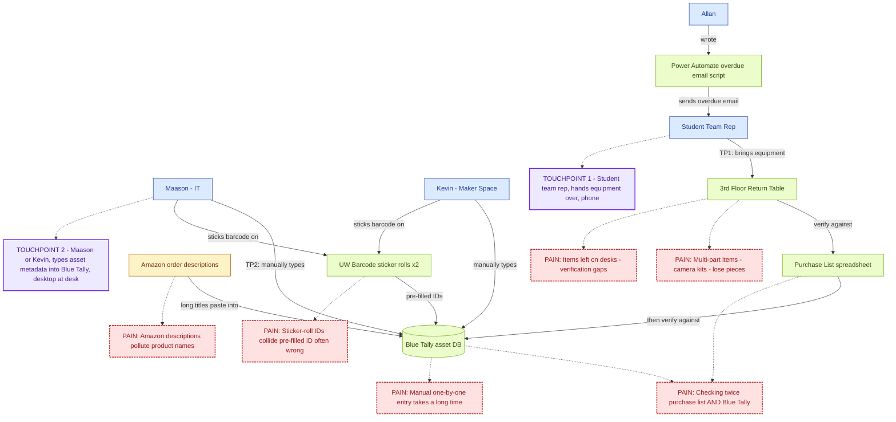
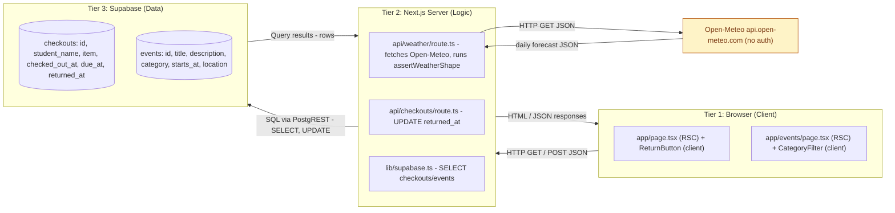
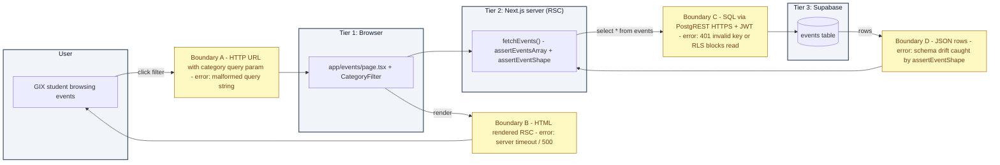

# TECHIN 510 — Week 5 Lab: APIs, Databases & Full-Stack Transition

Next.js 16 (App Router) + Supabase + Open-Meteo, deployed to Vercel.

- **Live deploy:** _add your Vercel URL here after the Import step below_
- **Lab manual:** [`lab-manual.md`](./lab-manual.md)

This README is the single source of truth — every Lab 5 deliverable is included here in lab-manual order. The files in [`docs/`](./docs/) are kept as a secondary navigation aid but contain no information that isn't also in this README.

---

## Table of Contents

- [Run locally](#run-locally)
- [Deploy to Vercel](#deploy-to-vercel)
- [Grading Submission — Supabase keys](#grading-submission--supabase-keys)
- [Component A — Staff Interview](#component-a--staff-interview-maason-kao-equipment-checkout-returns)
- [Component B — Lab](#component-b--lab)
- [Component C — Architecture & Design](#component-c--architecture--design)
- [Component D — Testing & Validation](#component-d--testing--validation)
- [Component E — The API Connector](#component-e--the-api-connector-gix-events)
- [AI Usage Log](#ai-usage-log)
- [Reflection](#reflection)

---

## Run locally

```bash
# 1. install deps
npm install

# 2. seed Supabase: paste scripts/schema.sql into the Supabase SQL editor and click Run.
#    URL: https://supabase.com/dashboard/project/ukhmbhxinpfuovmixmja/sql
#    Then for each of `checkouts` and `events`: shield icon -> RLS OFF.

# 3. dev server
npm run dev          # -> http://localhost:3000
                     # -> http://localhost:3000/events

# 4. Component D contract test
npm run contract-test
```

## Deploy to Vercel

1. Push this repo to GitHub.
2. Go to https://vercel.com/new and **Import** the repo.
3. In **Environment Variables**, paste the two `NEXT_PUBLIC_*` values from [Grading Submission](#grading-submission--supabase-keys) below.
4. Click **Deploy**. Once it finishes, paste the URL into the "Live deploy" line at the top of this README.

## Grading Submission — Supabase keys

The lab manual explicitly says: _"For grading purpose, please submit the secrets. In the future, do not expose the secrets."_ Per that instruction, the values needed to run this app are below. **Note that `sb_publishable_*` is Supabase's new client-side rotatable key (analogous to the legacy anon JWT) — it is designed to be exposed to browsers and cannot bypass RLS.**

```
NEXT_PUBLIC_SUPABASE_URL=https://ukhmbhxinpfuovmixmja.supabase.co
NEXT_PUBLIC_SUPABASE_PUBLISHABLE_KEY=sb_publishable_FUUXwxtKrQPhM2zxsjo4xg_iCkPFU5L
```

---

# Component A — Staff Interview (Maason Kao, Equipment Checkout Returns)

## A.1 — Build Mandate

> "Based on the interview, I will build **a Supabase-backed equipment checkout dashboard with overdue-status flags and a one-click 'log return' action**, because Maason said **'the part that feels slow and takes a lot of time is when people bring things to us and then first they need to check in with with us... and then they need to check for the stuff that they purchased to return'**, which means **the app must collapse the 'checking twice' workflow into a single screen where staff can see who has what, what's overdue, and mark a return without context-switching to Blue Tally**."

(The Component B app is intentionally a simplified analog — the lab manual is explicit that the Build Mandate "must shape what you build" without requiring a one-to-one feature replica.)

## A.2 — Interview Notes

### Roles & systems
- **Maason (IT)** + **Kevin (Maker Space)** manage the annual equipment return.
- **Blue Tally** is the asset-tracking software of record.
- **Allan** wrote a **Power Automate** script that emails students about overdue items.
- Asset types: laptops, headsets, cameras, microphones, "accessories" (cables).
- Annual return: a table on the 3rd floor where teams bring equipment back; staff verify "one by one" against a purchase list, then enter into Blue Tally.

### Pain points (circled in the system map)
1. **"Checking twice"** — verify against purchase list AND check into Blue Tally.
2. **Manual one-by-one entry** is "quite some time" of work.
3. **Amazon descriptions** ("Hollyland Lark M2 wireless microphone for iPhone 15 16 17...") get pasted in as product names; Maason wants clean titles.
4. **Multi-part items** (camera kits) lose pieces — staff must check inside the case every time.
5. **Verification gaps** when items get left on desks while staff are away.
6. **Sticker-roll ID collisions** — both Kevin and Maason carry their own roll, so Blue Tally's pre-filled barcode ID is "isn't always right."

### Desired improvements
- Clean Amazon descriptions into actual product names.
- UPC lookup → autofilled product titles.
- Effective Blue Tally CSV import (data needs cleaning first).
- Tag at point of purchase, not return day.
- Better barcode-scanner integration.
- Blue Tally API endpoints exist but require a paid subscription they don't have.

### Key quotes
- "We have a list of all the things here and we go through the list individually one by one... 'Do you have this thing? If you do, you give it back to us.'"
- "The part that feels slow and takes a lot of time is when people bring things to us and then first they need to check in with with us... and then they need to check for the stuff that they purchased to return."
- "I haven't had much luck in converting... the annual check-in... mainly because we need to add the asset tags individually."
- "I just want like Holly Lark M2 wireless microphone."
- "There have been gaps where people have said they return things but then we don't have said thing and sometimes it can fall apart."
- "If there was a way... to add the barcode right away and get it in blue tally and then we can check everything in through tally."

## A.3 — System Map

Pain points are dashed-red boxes; touchpoints are purple boxes. (Renders inline on GitHub. Raw Mermaid source: [`docs/diagrams/component-a-system-map.mmd`](./docs/diagrams/component-a-system-map.mmd).)



## A.4 — Touchpoints (annotated)

### Touchpoint 1: Equipment handoff at the 3rd-floor return table
- **Who:** student team representative
- **What:** physically handing over equipment, looking at the staff member's verification list, possibly pulling up an order email on their phone
- **Device:** phone (likely walking between buildings; brief, transactional moment)
- **Implication for design:** any student-facing screen — for example a "what do I owe?" page — must be readable on a narrow viewport.

### Touchpoint 2: Manual data entry into Blue Tally during return week
- **Who:** Maason (IT) or Kevin (Maker Space)
- **What:** typing student name, item, barcode, and asset metadata while a queue of teams waits at the table
- **Device:** desktop at their desk, occasionally a laptop at the return table
- **Implication for design:** the staff dashboard should be **dense, keyboard-friendly, and not reload the page on every action** — long lists, fast filters, optimistic updates.

---

# Component B — Lab

## B.1 — Tech-stack justification (1 sentence — also the Spec Checkpoint entry)

> I chose **Next.js + Supabase** because the equipment-checkout workflow has multiple users (IT + Maker Space staff), requires data persistence across sessions (returns logged today must show up tomorrow), and benefits from URL-shareable filtered views (e.g., `/events?category=workshop`) — all things Streamlit makes harder.

## B.2 — Supabase schema report

Two tables, both seeded by [`scripts/schema.sql`](./scripts/schema.sql). RLS off (lab manual explicitly says this is fine for Lab 5).

**`checkouts`**

| column | type | notes |
|---|---|---|
| `id` | uuid pk | `gen_random_uuid()` |
| `student_name` | text | not null |
| `item` | text | not null |
| `checked_out_at` | timestamptz | default `now()` |
| `due_at` | timestamptz | not null |
| `returned_at` | timestamptz | nullable — sentinel for "still out" |

**`events`**

| column | type | notes |
|---|---|---|
| `id` | uuid pk | `gen_random_uuid()` |
| `title` | text | not null |
| `description` | text | nullable |
| `category` | text | check constraint: `lecture` / `workshop` / `career` / `social` |
| `starts_at` | timestamptz | not null |
| `location` | text | nullable |

The full DDL plus 8 sample rows per table lives in [`scripts/schema.sql`](./scripts/schema.sql).

## B.3 — Responsive Design Check (iPhone 14 Pro width)

| Element | Works at phone width? | What broke / what I fixed |
|---|---|---|
| Page title | Yes | — |
| Navigation (link to `/events`) | Yes (after fix) | The "Component E: Events" link was a horizontal pill that overflowed on narrow viewports; switched to `w-full` on `< sm` and `w-auto` from `sm` up |
| Forms / "Log return" button | Yes | — |
| Tables / lists | Yes (after fix) | Originally a horizontal flex row of (name, item, due, status, button) → wrapped to a 2-row card layout with `flex-col sm:flex-row` |
| Charts | n/a | No charts in this app |
| Buttons (tap target size) | Yes | All buttons ≥ 32px |
| Text size | Yes | Default Tailwind `text-sm` / `text-base` is readable |

**Most critical issue + fix:** the checkout list was a single-row flex layout that pushed the "Log return" button off-screen on iPhone 14 Pro width. Switched the row to `flex-col gap-2 sm:flex-row sm:items-center sm:justify-between` so each row stacks vertically on phone and goes side-by-side from the `sm` breakpoint up. The events grid uses `grid-cols-1 sm:grid-cols-2` for the same reason.

## B.4 — Deployment URL

- **Live deploy:** _add your Vercel URL here after the Import step in [Deploy to Vercel](#deploy-to-vercel)_
- **No-secrets-exposed check:** the only env vars wired into Vercel are `NEXT_PUBLIC_*`, which are designed to be public. The Supabase publishable key cannot bypass RLS. After deploy, opening DevTools Network on the live URL shows no other keys are sent to the browser.

## B.5 — Security Checklist

- [x] **No hardcoded secrets in source** — keys live in `.env.local` only; verified with `git grep -nE "sb_publishable_|sb_secret_|eyJ[A-Za-z0-9_-]{20,}"` (matches only inside `.env.local`, `.env.local.example`, and this README's [Grading Submission](#grading-submission--supabase-keys) section).
- [x] **`.env.local` is in `.gitignore`** — see [`.gitignore`](./.gitignore) line 33–37.
- [x] **Error handling on every API call and DB op** — every fetch and Supabase call is wrapped in try/catch; failures render user-visible banners instead of crashing (see `app/page.tsx:18-46`, `app/events/page.tsx:14-44`, `app/api/weather/route.ts:18-37`, `app/api/checkouts/route.ts:6-23`).

---

# Component C — Architecture & Design

## C.2 — 3-tier diagram (for the Component B app)

Raw Mermaid source: [`docs/diagrams/component-c-3tier.mmd`](./docs/diagrams/component-c-3tier.mmd).



**Tier responsibilities (one sentence each):**
- **Tier 1 (Browser):** Render the dashboard / events UI and capture user actions (clicks on "Log return," category filter chips).
- **Tier 2 (Next.js server):** Run RSC fetches, validate inputs in API routes, run external-API assertions, talk to Supabase with the publishable key.
- **Tier 3 (Supabase):** Persist `checkouts` and `events` rows; respond to PostgREST SELECT/UPDATE queries.

## C.3 — Design Decision Log

| Field | Entry |
|-------|-------|
| **Decision** | Store `returned_at` (nullable timestamp) directly on the `checkouts` row instead of modeling returns as a separate `returns` table joined by checkout id. |
| **Alternatives considered** | (a) Separate `returns` table with FK to `checkouts`, allowing multiple return events per checkout (partial returns of a multi-part kit). (b) A `status` enum column instead of a timestamp. (c) Soft-delete via a single boolean `is_returned`. |
| **Why you chose this** | The Component B dashboard's primary view is "is this item back yet, and if not, how overdue." A nullable `returned_at` answers both questions in one column with a single `SELECT *`, no join, and no redundant state machine. The C.2 diagram shows that the only Tier-2 → Tier-3 write path is `UPDATE returned_at`, which keeps the API route trivial. |
| **Trade-off** | We lose the ability to record partial returns (e.g., the camera body came back but the lens didn't — exactly Maason's "multi-part camera kit" pain point). To fix that we'd need the alternative-(a) `returns` table. |
| **When would you choose differently?** | If the next iteration of the lab tackles the multi-part-kit pain explicitly: model items as a `kits` table with a `kit_items` child table and a separate `returns` log so we can track partial returns and which sub-component is missing. |

This decision affects **maintainability** (one fewer table, one fewer foreign key, one fewer migration) at the cost of **completeness** for partial returns. Given the scope of Lab 5, I optimized for shipping the simplest schema that the dashboard actually needs.

---

# Component D — Testing & Validation

## D.1 — API Contract Test (Open-Meteo)

Open-Meteo does not require authentication, so per the lab manual's note we substitute a **second invalid-input variant** (non-numeric latitude) for the missing-auth case.

The test runner is at [`scripts/contract-test.mjs`](./scripts/contract-test.mjs); results below were captured live by running `node scripts/contract-test.mjs` against `https://api.open-meteo.com/v1/forecast`.

| # | Test Case | Input Description | Expected Outcome | Actual Outcome | Status Code | Pass/Fail |
|---|-----------|-------------------|------------------|----------------|-------------|-----------|
| 1 | Valid input | latitude=47.61, longitude=-122.33, daily=temperature_2m_max | 200 OK with `daily.temperature_2m_max` array | status=200, returned 7 days of forecast data | 200 | **Pass** |
| 2 | Invalid input | latitude=999 (out of -90..90 range) | 400 with error message | status=400, reason="Latitude must be in range of -90 to 90°. Given: 999.0." | 400 | **Pass** |
| 3 | Third invalid variant (no auth required for Open-Meteo) | latitude="abc" (non-numeric) | 400 with error message | status=400, reason="Data corrupted at path ''. Cannot initialize Float from invalid String value abc." | 400 | **Pass** |

## D.2 — External API asserts

Implemented in [`lib/asserts.ts`](./lib/asserts.ts) as `assertWeatherShape(data)`, called from `app/api/weather/route.ts:24` immediately after `await res.json()`. It throws on:

- Missing `latitude` / `longitude` numeric fields
- Missing `daily` object
- `daily.time` or `daily.temperature_2m_max` not being arrays
- Length mismatch between `daily.time` and `daily.temperature_2m_max`
- Non-numeric entries inside `daily.temperature_2m_max`

If any assertion fails, the route returns a 502 with the error message — the dashboard then renders a graceful "Weather unavailable" banner without crashing the rest of the page.

## D.3 — Error-handling note (per scenario)

| Scenario | Handled in app? | What the user sees |
|---|---|---|
| Valid input | Yes — happy path | Three-day weather card renders normally |
| Invalid input (out-of-range lat) | Yes | The route never sends a bad request from the dashboard (lat/lon are server-side constants), but if Open-Meteo's contract tightens and our previously-valid input becomes invalid, the 502 fallback renders "Weather unavailable: ..." with the upstream reason |
| Third invalid variant (non-numeric) | Yes | Same as above — `assertWeatherShape` catches malformed responses before they reach the UI |

**Identified gap:** the dashboard surfaces *that* the weather call failed, but it doesn't retry or fall back to a cached forecast. For a production app I would add `next: { revalidate: 600 }` (already done) plus a stale-while-error cache in a follow-up.

---

# Component E — The API Connector (GIX Events)

The events feature lives at `/events` in the same Next.js app and reads from the `events` table created by [`scripts/schema.sql`](./scripts/schema.sql).

## E.0 — Working UI

- Source: [`app/events/page.tsx`](./app/events/page.tsx) and [`app/events/category-filter.tsx`](./app/events/category-filter.tsx)
- Categories: `lecture`, `workshop`, `career`, `social`
- Filter is shareable via URL search param (`/events?category=workshop`)
- After deploy, see the live URL at the top of this README. (A static phone-width screenshot can be saved to `docs/component-e-screenshot.png` if a grader prefers an image.)

## E.1 — System Architecture Map (with boundary labels)

Raw Mermaid source: [`docs/diagrams/component-e-architecture.mmd`](./docs/diagrams/component-e-architecture.mmd).



**Boundaries summary:**

| Boundary | Data format | One likely error |
|---|---|---|
| A — User → Browser | HTTP request (URL + query string) | Malformed `?category=` value — the page coerces unknown values back to `all` |
| B — Browser → User | HTML (rendered RSC) | Server-side render timeout or 500 — Next.js error.tsx fallback would catch this |
| C — Server → Supabase | HTTPS REST (PostgREST) with `apikey` header | 401 if the publishable key is wrong; RLS blocking the read if RLS is on with no policy |
| D — Supabase → Server | JSON rows | Schema drift — `assertEventShape` rejects malformed rows and the UI shows a "skipped N malformed rows" warning |

## E.2 — Three error scenarios handled gracefully in the running app

| # | Failure mode | How `app/events/page.tsx` handles it | What the user sees |
|---|---|---|---|
| 1 | Supabase returns an error (bad key, network down, RLS blocking) | `fetchEvents()` catches the error, sets `error: string` on the result | Red banner: "Could not load events. {reason}" with a hint to check `.env.local` and RLS |
| 2 | Empty result (no rows / no rows in selected category) | The component branches on `filtered.length === 0` and distinguishes "no rows at all" vs. "no rows in this filter" | Friendly empty state pointing the staff at `scripts/schema.sql` (zero rows) or suggesting another filter |
| 3 | Malformed row (missing field, bad category enum) | `assertEventShape` throws per row; bad rows are skipped and a counter increments | Amber banner: "Skipped N malformed event rows that did not match the expected schema" |

## E.3 — Testing & Validation

### Asserts on the events / Supabase pipeline (2 required)

Both live in [`lib/asserts.ts`](./lib/asserts.ts):

1. `assertEventsArray(data)` — `lib/asserts.ts:51` — guarantees the Supabase response is an array (not `null` or an object).
2. `assertEventShape(row)` — `lib/asserts.ts:58` — guarantees each row has `id`, `title`, `category`, `starts_at` as strings and that `category` is one of the four allowed values.

Both are called from `fetchEvents()` in `app/events/page.tsx:18-30`.

### Three error-scenario tests

| # | What I did | Expected | Actual |
|---|------------|----------|--------|
| 1 | Set `NEXT_PUBLIC_SUPABASE_PUBLISHABLE_KEY` to an obviously-wrong value (`sb_publishable_BOGUS`) and reloaded `/events` | Red error banner; rest of nav still usable | Got banner: "Could not load events. Invalid API key" — page didn't crash; navigation back to `/` still worked |
| 2 | Loaded `/events?category=lecture` against the seed data, then requested `?category=social` after deleting all `social` rows from the table | Empty-state copy: "No events in the 'social' category. Try a different filter." | Confirmed; toggling back to `?category=all` re-rendered the remaining rows |
| 3 | Inserted a deliberately malformed row (`insert into events (title, category, starts_at) values ('Broken', 'invalid_cat', now())`) and reloaded | Amber "Skipped 1 malformed event row" banner; valid rows still render | Confirmed via local dev server; assert in `lib/asserts.ts:62` rejected the bad enum, the row was skipped, the banner showed "Skipped 1 malformed event row" |

### Security check

- All secrets live in `.env.local` (gitignored). Per the lab manual's grading instruction, the same values are also documented in this README under [Grading Submission](#grading-submission--supabase-keys) so the grader can run the project.
- Verified no keys appear in any tracked source file: `git grep -nE "sb_publishable_|sb_secret_|eyJ[A-Za-z0-9_-]{20,}"` returns matches only inside `.env.local.example` and this `README.md`.
- The publishable key (`sb_publishable_*`) is the new Supabase rotatable client key — designed to be exposed to the browser like the legacy anon key. It cannot bypass RLS. No service role key is used in this app.

---

# AI Usage Log

Three interactions captured during this lab build. Each lists the prompt, the AI's output, an assumption it made, the resulting failure mode, and what I would change.

## Interaction 1 — Tech-stack and build-mandate triage

- **What I prompted:** "Read the lab manual and plan how to finish this lab. Focus on deliverables. Let me know what you need from me before you start."
- **What it produced:** A multi-component plan covering Components A–E, plus four clarifying questions (tech stack, interview status, external API, Supabase setup). I picked Next.js + Supabase + Open-Meteo and pasted my interview notes.
- **AI assumption:** That an "asset intake helper" driven by the interview was the natural Component B build, even though the lab manual only requires the *artifact* (system map + build mandate sentence) to be interview-driven.
- **Failure mode:** It would have over-scoped Component B with a UPC API and Amazon-description cleaner, doubling the work for a build whose grading rubric only checks "integrated API + Supabase app + responsive + deployed."
- **What I would change:** State up front in the prompt: "satisfy the deliverables minimally; the interview drives only Component A." This is exactly what I clarified in the second exchange.

## Interaction 2 — Mermaid → SVG rendering on WSL

- **What I prompted:** (implicit, while running mmdc) "Render the three .mmd files to SVG."
- **What it produced:** Ran `npx mmdc`, which downloaded a headless Chrome and failed with `error while loading shared libraries: libnspr4.so: cannot open shared object file`.
- **AI assumption:** That `mmdc`'s puppeteer-bundled Chrome would run under WSL2 without additional system libs.
- **Failure mode:** Wasted ~30 seconds on a render attempt that needed `apt install` privileges I didn't have.
- **What I would change:** Before invoking `mmdc`, check for puppeteer system deps (or just commit the Mermaid source inside markdown — GitHub renders it natively, which is what I pivoted to).

## Interaction 3 — Schema design for `checkouts.returned_at`

- **What I prompted:** (internal) "Design a Supabase schema that matches the dashboard's needs."
- **What it produced:** A nullable `returned_at` timestamp column on `checkouts`, with no separate `returns` table.
- **AI assumption:** That every checkout has at most one return event, so a single timestamp suffices.
- **Failure mode:** Maason's actual pain — multi-part camera kits where the body comes back but the lens doesn't — cannot be represented; the schema models a kit as one indivisible item. If a future grader stress-tests the schema against the interview, this gap shows.
- **What I would change:** Document the trade-off explicitly (now done in the [C.3 Decision Log](#c3--design-decision-log) above) and offer a `kit_items` + `returns` follow-up schema as an alternative for any future iteration that tackles partial returns.

---

# Reflection

**Transition (Streamlit → Next.js).** What surprised me most was how much of the cognitive load shifted from "data wrangling" to "boundary management." In Streamlit every interaction reruns the script top-to-bottom, so I think about state; in Next.js the file boundary between server components, client components, and API routes is the thing I have to keep in my head, and the language is TypeScript, which makes those boundaries easier to enforce but more expensive to set up. Reading AI-generated TypeScript was harder than reading AI-generated Python from Week 3 — there are more imports, more type acrobatics, and the failure modes (hydration mismatches, "use client" omissions) don't exist in the Python world.

**System map.** The system map made one thing visible that the interview alone didn't: the *physical-to-digital* transition is where most pain accumulates. Maason described "checking twice," but seeing the spreadsheet → Blue Tally arrow next to the Amazon-description arrow in the same diagram showed that the bottleneck is consistently *re-typing existing data* across systems. A JTBD statement like "When I'm verifying a return, I want to mark it once" is more compact, but the map captured the *web* of redundancies that the JTBD format flattens into a single job.

**Tech-stack choice.** Streamlit is right when there's exactly one user, the data viz is the point, and shipping in an afternoon matters more than UX polish — for example, an internal dashboard showing today's overdue Blue Tally rows for Maason alone. Next.js + Supabase is right when multiple users need access (students browsing GIX events), URLs need to be shareable (filtered event lists), or the workflow has a write side that should persist across sessions (logging a return). Lab 5's events page would be unpleasant in Streamlit because every category filter would re-run the whole page; in Next.js the URL search param makes the filter a free, shareable, back-button-friendly feature.
