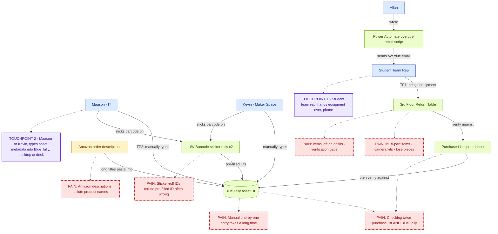

# Component A — Staff Interview (Maason Kao, Equipment Checkout Returns)

## Build Mandate

> "Based on the interview, I will build **a Supabase-backed equipment checkout dashboard with overdue-status flags and a one-click 'log return' action**, because Maason said **'the part that feels slow and takes a lot of time is when people bring things to us and then first they need to check in with with us... and then they need to check for the stuff that they purchased to return'**, which means **the app must collapse the 'checking twice' workflow into a single screen where staff can see who has what, what's overdue, and mark a return without context-switching to Blue Tally**."

(The Component B app is intentionally a simplified analog — the lab manual is explicit that the Build Mandate "must shape what you build" without requiring a one-to-one feature replica.)

## Interview Notes

### Roles & systems
- **Maason (IT)** + **Kevin (Maker Space)** manage the annual equipment return.
- **Blue Tally** is the asset-tracking software of record.
- **Allan** wrote a **Power Automate** script that emails students about overdue items.
- Asset types: laptops, headsets, cameras, microphones, "accessories" (cables).
- Annual return: a table on the 3rd floor where teams bring equipment back; staff verify "one by one" against a purchase list, then enter into Blue Tally.

### Pain points (circled in the system map)
1. **"Checking twice"** — verify against purchase list AND check into Blue Tally.
2. **Manual one-by-one entry** is "quite some time" of work.
3. **Amazon descriptions** ("Hollyland Lark M2 wireless microphone for iPhone 15 16 17...") get pasted in as product names; Maason wants clean titles.
4. **Multi-part items** (camera kits) lose pieces — staff must check inside the case every time.
5. **Verification gaps** when items get left on desks while staff are away.
6. **Sticker-roll ID collisions** — both Kevin and Maason carry their own roll, so Blue Tally's pre-filled barcode ID is "isn't always right."

### Desired improvements
- Clean Amazon descriptions into actual product names.
- UPC lookup → autofilled product titles.
- Effective Blue Tally CSV import (data needs cleaning first).
- Tag at point of purchase, not return day.
- Better barcode-scanner integration.
- Blue Tally API endpoints exist but require a paid subscription they don't have.

### Key quotes
- "We have a list of all the things here and we go through the list individually one by one... 'Do you have this thing? If you do, you give it back to us.'"
- "The part that feels slow and takes a lot of time is when people bring things to us and then first they need to check in with with us... and then they need to check for the stuff that they purchased to return."
- "I haven't had much luck in converting... the annual check-in... mainly because we need to add the asset tags individually."
- "I just want like Holly Lark M2 wireless microphone."
- "There have been gaps where people have said they return things but then we don't have said thing and sometimes it can fall apart."
- "If there was a way... to add the barcode right away and get it in blue tally and then we can check everything in through tally."

## System Map

Pain points are dashed-red boxes; touchpoints are purple boxes.

> The raw Mermaid source is also at `docs/diagrams/component-a-system-map.mmd` if you want to re-render it elsewhere.

## Touchpoints — annotated

### Touchpoint 1: Equipment handoff at the 3rd-floor return table
- **Who:** student team representative
- **What:** physically handing over equipment, looking at the staff member's verification list, possibly pulling up an order email on their phone
- **Device:** phone (likely walking between buildings; brief, transactional moment)
- **Implication for design:** any student-facing screen — for example a "what do I owe?" page — must be readable on a narrow viewport.

### Touchpoint 2: Manual data entry into Blue Tally during return week
- **Who:** Maason (IT) or Kevin (Maker Space)
- **What:** typing student name, item, barcode, and asset metadata while a queue of teams waits at the table
- **Device:** desktop at their desk, occasionally a laptop at the return table
- **Implication for design:** the staff dashboard should be **dense, keyboard-friendly, and not reload the page on every action** — long lists, fast filters, optimistic updates.
