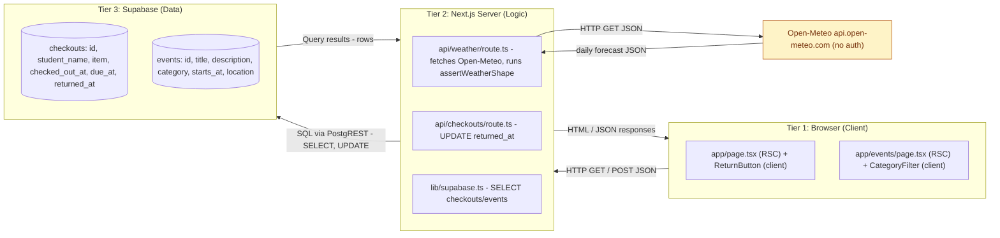

# Component C — Architecture & Design

## C.2 — 3-tier diagram (for the Component B app)

**Tier responsibilities (one sentence each):**
- **Tier 1 (Browser):** Render the dashboard / events UI and capture user actions (clicks on "Log return," category filter chips).
- **Tier 2 (Next.js server):** Run RSC fetches, validate inputs in API routes, run external-API assertions, talk to Supabase with the publishable key.
- **Tier 3 (Supabase):** Persist `checkouts` and `events` rows; respond to PostgREST SELECT/UPDATE queries.

> Raw Mermaid source: `docs/diagrams/component-c-3tier.mmd`.

## C.3 — Design Decision Log

| Field | Entry |
|-------|-------|
| **Decision** | Store `returned_at` (nullable timestamp) directly on the `checkouts` row instead of modeling returns as a separate `returns` table joined by checkout id. |
| **Alternatives considered** | (a) Separate `returns` table with FK to `checkouts`, allowing multiple return events per checkout (partial returns of a multi-part kit). (b) A `status` enum column instead of a timestamp. (c) Soft-delete via a single boolean `is_returned`. |
| **Why you chose this** | The Component B dashboard's primary view is "is this item back yet, and if not, how overdue." A nullable `returned_at` answers both questions in one column with a single `SELECT *`, no join, and no redundant state machine. The C.2 diagram shows that the only Tier-2 → Tier-3 write path is `UPDATE returned_at`, which keeps the API route trivial. |
| **Trade-off** | We lose the ability to record partial returns (e.g., the camera body came back but the lens didn't — exactly Maason's "multi-part camera kit" pain point). To fix that we'd need the alternative-(a) `returns` table. |
| **When would you choose differently?** | If the next iteration of the lab tackles the multi-part-kit pain explicitly: model items as a `kits` table with a `kit_items` child table and a separate `returns` log so we can track partial returns and which sub-component is missing. |

This decision affects **maintainability** (one fewer table, one fewer foreign key, one fewer migration) at the cost of **completeness** for partial returns. Given the scope of Lab 5, I optimized for shipping the simplest schema that the dashboard actually needs.
