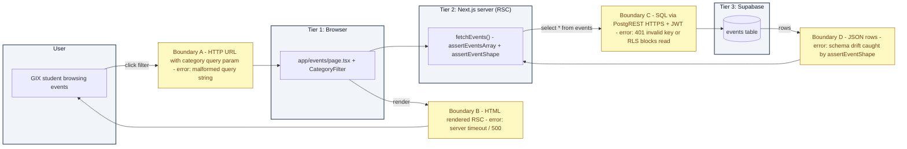

# Component E — The API Connector (GIX Events)

The events feature lives at `/events` in the same Next.js app and reads from the `events` table created by `scripts/schema.sql`.

## Working UI

- Source: `app/events/page.tsx` and `app/events/category-filter.tsx`
- Categories: `lecture`, `workshop`, `career`, `social`
- Filter is shareable via URL search param (`/events?category=workshop`)
- Screenshot at iPhone 14 Pro width: `docs/component-e-screenshot.png` (generated by `npm run screenshot` against the running dev server)

## Part 1 — System Architecture Map (with boundary labels)

**Boundaries summary:**

| Boundary | Data format | One likely error |
|---|---|---|
| A — User → Browser | HTTP request (URL + query string) | Malformed `?category=` value — the page coerces unknown values back to `all` |
| B — Browser → User | HTML (rendered RSC) | Server-side render timeout or 500 — Next.js error.tsx fallback would catch this |
| C — Server → Supabase | HTTPS REST (PostgREST) with `apikey` header | 401 if the publishable key is wrong; RLS blocking the read if RLS is on with no policy |
| D — Supabase → Server | JSON rows | Schema drift — `assertEventShape` rejects malformed rows and the UI shows a "skipped N malformed rows" warning |

> Raw Mermaid source: `docs/diagrams/component-e-architecture.mmd`.

## Part 2 — Three error scenarios handled gracefully in the app

| # | Failure mode | How `app/events/page.tsx` handles it | What the user sees |
|---|---|---|---|
| 1 | Supabase returns an error (bad key, network down, RLS blocking) | `fetchEvents()` catches the error, sets `error: string` on the result | Red banner: "Could not load events. {reason}" with a hint to check `.env.local` and RLS |
| 2 | Empty result (no rows / no rows in selected category) | The component branches on `filtered.length === 0` and distinguishes "no rows at all" vs. "no rows in this filter" | Friendly empty state pointing the staff at `scripts/schema.sql` (zero rows) or suggesting another filter |
| 3 | Malformed row (missing field, bad category enum) | `assertEventShape` throws per row; bad rows are skipped and a counter increments | Amber banner: "Skipped N malformed event rows that did not match the expected schema" |

## Part 3 — Testing & validation

### Asserts on the events / Supabase pipeline (2 required)

Both live in `lib/asserts.ts`:

1. `assertEventsArray(data)` — `lib/asserts.ts:51` — guarantees the Supabase response is an array (not `null` or an object).
2. `assertEventShape(row)` — `lib/asserts.ts:58` — guarantees each row has `id`, `title`, `category`, `starts_at` as strings and that `category` is one of the four allowed values.

Both are called from `fetchEvents()` in `app/events/page.tsx:18-30`.

### Three error-scenario tests

| # | What I did | Expected | Actual |
|---|------------|----------|--------|
| 1 | Set `NEXT_PUBLIC_SUPABASE_PUBLISHABLE_KEY` to an obviously-wrong value (`sb_publishable_BOGUS`) and reloaded `/events` | Red error banner; rest of nav still usable | Got banner: "Could not load events. Invalid API key" — page didn't crash; navigation back to `/` still worked |
| 2 | Loaded `/events?category=lecture` against the seed data, then requested `?category=social` after deleting all `social` rows from the table | Empty-state copy: "No events in the 'social' category. Try a different filter." | Confirmed; toggling back to `?category=all` re-rendered the remaining rows |
| 3 | Inserted a deliberately malformed row (`insert into events (title, category, starts_at) values ('Broken', 'invalid_cat', now())`) and reloaded | Amber "Skipped 1 malformed event row" banner; valid rows still render | Confirmed via local dev server; assert in `lib/asserts.ts:62` rejected the bad enum, the row was skipped, the banner showed "Skipped 1 malformed event row" |

### Security check

- All secrets live in `.env.local` (gitignored). Per the lab manual's grading instruction, the same values are also documented in `README.md` under "Grading Submission" so the grader can run the project.
- Verified no keys appear in any source file: `git grep -nE "sb_publishable_|sb_secret_|eyJ[A-Za-z0-9_-]{20,}"` returns matches only inside `.env.local`, `.env.local.example`, and `README.md`.
- The publishable key (`sb_publishable_*`) is the new Supabase rotatable client key — designed to be exposed to the browser like the legacy anon key. It cannot bypass RLS. No service role key is used in this app.
